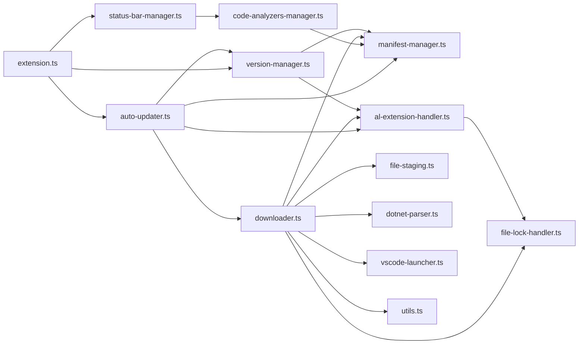
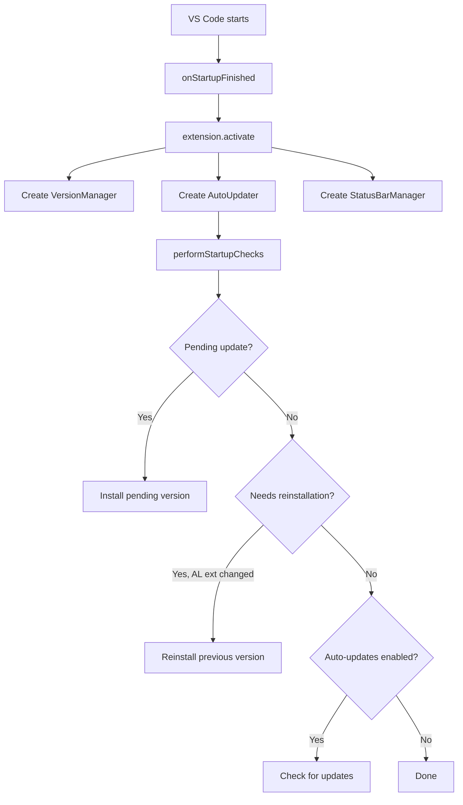
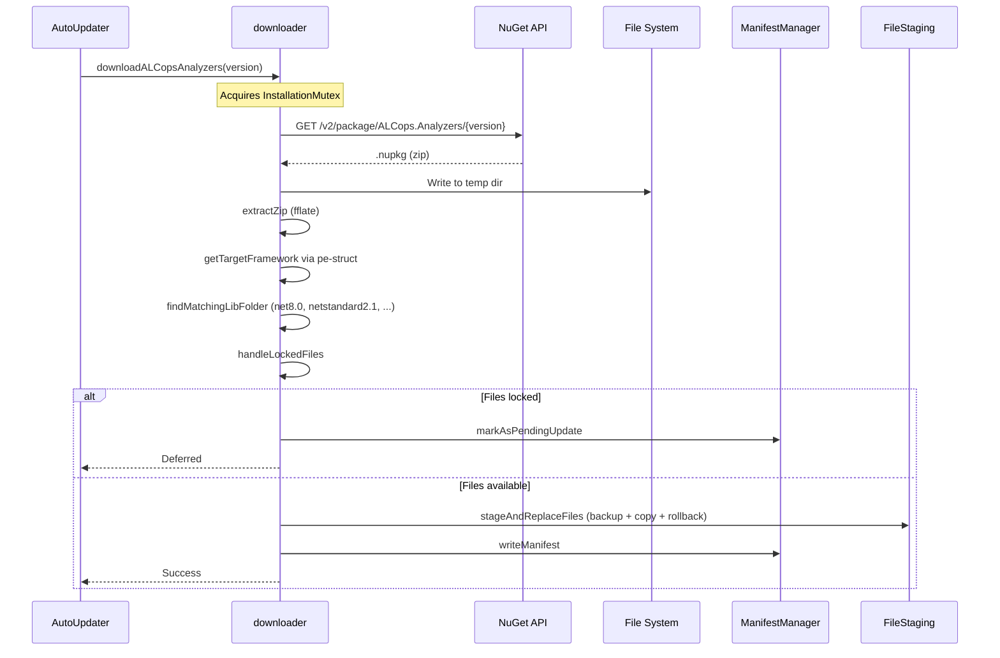

# Contributing to ALCops for VS Code

Contributions are welcome, whether it's a bug fix, new feature, documentation improvement, or just a typo correction. This guide covers everything you need to get started.

## Table of Contents

- [Getting Started](#getting-started)
- [Development Setup](#development-setup)
- [Project Structure](#project-structure)
- [Architecture Overview](#architecture-overview)
- [Build and Run](#build-and-run)
- [Code Style](#code-style)
- [Branching and Versioning](#branching-and-versioning)
- [Submitting a Pull Request](#submitting-a-pull-request)
- [Reporting Issues](#reporting-issues)

## Getting Started

1. Fork the repository on GitHub
2. Clone your fork locally
3. Create a feature branch from `main`
4. Make your changes, commit, and push
5. Open a pull request against `main`

## Development Setup

**Prerequisites:**

- [Node.js](https://nodejs.org/) v22 or later
- [VS Code](https://code.visualstudio.com/) with the [AL Language extension](https://marketplace.visualstudio.com/items?itemName=ms-dynamics-smb.al) installed

**Install dependencies:**

```bash
git clone https://github.com/ALCops/vscode-extension.git
cd vscode-extension
npm ci
```

## Project Structure

```
├── src/
│   ├── extension.ts              # Entry point: activation, command registration
│   ├── auto-updater.ts           # Update lifecycle: check, notify, install
│   ├── version-manager.ts        # Tracks installed version, check intervals, reinstall logic
│   ├── downloader.ts             # Downloads and extracts NuGet packages from nuget.org
│   ├── manifest-manager.ts       # Reads/writes .alcops-manifest.json in the Analyzers folder
│   ├── code-analyzers-manager.ts # Discovers analyzers from manifest, manages quick-pick list
│   ├── status-bar-manager.ts     # Status bar item showing active analyzer count
│   ├── dotnet-parser.ts          # Reads .NET assembly metadata via pe-struct to detect TFM
│   ├── file-lock-handler.ts      # Detects locked DLLs (Windows EACCES/EPERM/EBUSY)
│   ├── file-staging.ts           # Atomic file replacement with backup and rollback
│   ├── al-extension-handler.ts   # Locates the AL extension and prompts for locked files
│   ├── vscode-launcher.ts        # Spawns a new VS Code window (cross-platform)
│   └── utils.ts                  # Shared helpers (formatError)
├── dist/                         # esbuild output (gitignored)
├── esbuild.mjs                   # Bundle configuration
├── eslint.config.mjs             # ESLint flat config
├── tsconfig.json                 # TypeScript configuration
├── GitVersion.yml                # GitVersion configuration for SemVer
└── package.json                  # Extension manifest, commands, settings, dependencies
```

### Module Dependency Graph



## Architecture Overview

### Activation Flow

When VS Code starts with the AL extension present, the extension activates and runs through a startup sequence:



### Download and Installation

The `downloader.ts` module handles downloading `.nupkg` packages from NuGet, extracting them, and deploying analyzer DLLs into the AL extension's `bin/Analyzers` folder.




### Key Design Decisions

- **InstallationMutex:** All downloads go through a single mutex in `downloader.ts`. This prevents race conditions when multiple triggers (startup check, manual command, background timer) try to install simultaneously.
- **File staging with rollback:** `file-staging.ts` backs up existing DLLs before overwriting. On partial failure, it rolls back to the previous state. This avoids leaving the Analyzers folder in a broken state.
- **Locked file handling:** On Windows, the AL Language extension locks analyzer DLLs while active. The extension detects this and offers to defer the update to the next startup, or close and relaunch VS Code.
- **Target framework detection:** Rather than hardcoding which .NET TFM to use, `dotnet-parser.ts` reads the PE metadata of `Microsoft.Dynamics.Nav.CodeAnalysis.dll` to determine the correct `lib/` subfolder from the NuGet package.
- **Zero-dependency zip extraction:** Uses `fflate` (pure JS, zero transitive dependencies) instead of `unzipper` to avoid bundling issues with optional AWS SDK requires.

## Build and Run

| Command | Description |
|---|---|
| `npm run bundle` | Bundle with esbuild (development, with sourcemaps) |
| `npm run watch:bundle` | Bundle in watch mode |
| `npm run compile` | TypeScript compilation (for type checking and tests) |
| `npm run typecheck` | Type check without emitting |
| `npm run lint` | Run ESLint |
| `npm run clean` | Remove `out/` and `dist/` |

**Run in VS Code:**

1. Open the project in VS Code
2. Press `F5` to launch the Extension Development Host
3. The extension activates automatically when the AL Language extension is present

**Package a VSIX:**

```bash
npx vsce package
```

## Code Style

- TypeScript strict mode
- ESLint enforces naming conventions, curly braces, strict equality, and semicolons
- Use `import` (ES modules) for all source files
- Suffix all local imports with `.js` (required for esbuild with TypeScript ESM-style resolution)
- Keep runtime dependencies minimal; prefer Node.js built-ins where possible
- Use `formatError()` from `utils.ts` for all user-facing error messages

## Branching and Versioning

The project uses [GitVersion](https://gitversion.net/) with [GitHubFlow](https://gitversion.net/docs/learn/branching-strategies/githubflow) for automatic SemVer calculation.

- **`main`** is the default branch.
- **`release/*`** branches trigger CI builds. Pushing a `v*` tag triggers a GitHub Release and VS Code Marketplace publish.
- Version numbers are derived automatically from Git history. Do not manually edit `version` in `package.json`.

## Submitting a Pull Request

1. Create a branch from `main` (e.g., `feature/my-change` or `fix/issue-123`)
2. Make focused, single-purpose commits
3. Run `npm run lint` and `npm run typecheck` before pushing
4. Open a PR against `main` with a clear description of what changed and why
5. CI runs lint, type check, and packaging automatically

## Reporting Issues

Open an issue at [github.com/ALCops/vscode-extension/issues](https://github.com/ALCops/vscode-extension/issues) with:

- VS Code version and OS
- AL Language extension version
- Steps to reproduce
- Expected vs actual behavior
- Any relevant error output from the Output panel (select "ALCops" or "Extension Host")

## License

By contributing, you agree that your contributions will be licensed under the [MIT License](LICENSE).
